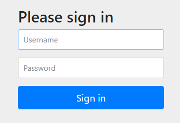
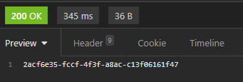
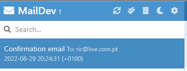
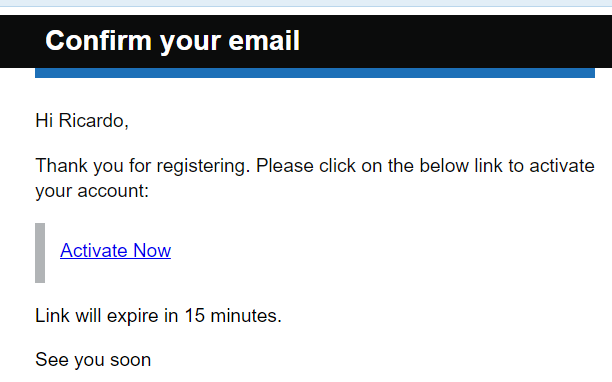
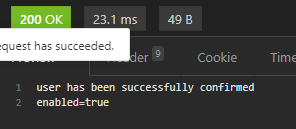

# Spring Boot oauth and email confirmation

## About
The following repo contains a Spring Boot example that shows how to implement oauth

## I've learned:
* how to use the spring-boot-starter-security dependency
* more lombok handy annotations
* how to use @Transactional annotation
* the use of .orElseThrow to throw an exception and the use of String.format(a,b)
* how to change project Java version and update with maven to check for errors/dependencies
* how to use BCryptPasswordEncoder
* new annotations: @Configuration, @Bean
* how to use @EnableWebSecurity and WebSecurityConfigurerAdapter, although it has been recently deprecated
* how to enable and disable CSRF in Spring Boot Security with HttpSecurity
* AuthenticationManagerBuilder and DaoAuthenticationProvider
* the usefulness of @EqualsAndHashCode and @SequenceGenerator
* debugging with the help of application.properties: spring.jpa.show-sql=true and/or spring.jpa.properties.hibernate.format_sql=true
* how to create a confirmation token
* the use of IllegalStateException in order to display modified Exceptions
* LOGGER and MimeMessage/Helper
* how to build email templates
* the existence and usefulness of maildev (used mailcatcher in the past)

## Run this application:
* create a postgres database named registration
* add your postgres credentials at resources/application.yml
```
spring:
  datasource:
    password: "password"
    url: jdbc:postgresql://localhost:5432/registration
    username: "username"
```
* connect your application to your database
* install and run maildev:
```
npm install -g maildev
maildev
```
* run application and open browser at both:
```
http://localhost:8080/
http://localhost:1080/
```
* Login Page appears:



* use Postman or Insomnia for the next requests
* POST - creates a new username and password
```
{
	"firstName": "Ricardo",
	"lastName": "Parada",
	"email": "ric@live.com.pt",
	"password": "password"
}

http://localhost:8080/api/v1/registration
```
* an access token will be generated and given on a 200:



* an e-mail will be sent to maildev, confirm registration:




* the Active Now link will be the same as doing the following request:
  * GET - paste the received access token and add it as a parameter:
```
http://localhost:8080/api/v1/registration/confirm?token=2acf6e35-fccf-4f3f-a8ac-c13f06161f47
```


* user is now registered and can now log in successfully
